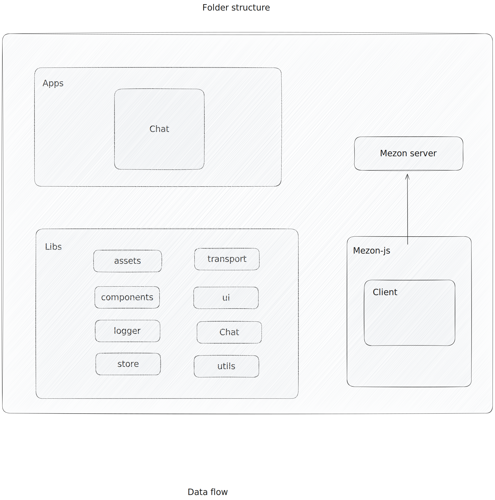

# Mezon Developer Guide

> This guide is for developers who want to contribute to Mezon, build integrations, or understand the technical architecture.

## Table of Contents

- [Prerequisites](#prerequisites)
- [Getting Started](#getting-started)
- [Architecture Overview](#architecture-overview)
- [Development Setup](#development-setup)
- [Project Structure](#project-structure)
- [Development Workflow](#development-workflow)
- [Testing](#testing)
- [Contributing](#contributing)
- [API Documentation](#api-documentation)
- [Troubleshooting](#troubleshooting)

## Prerequisites

Before you begin development, ensure you have the following installed:

- **Node.js** 18.17.0 or higher
- **Yarn** 1.22.17 or higher
- **Git Bash** (for Windows users)
- **Nx CLI**: Install globally with `npm install --global nx@latest`

## Getting Started

### 1. Clone the Repository

```bash
git clone https://github.com/mezonai/mezon.git
cd mezon
```

### 2. Install Dependencies

```bash
yarn install
```

### 3. Environment Setup

Create a `.env` file in the `apps/chat` directory with the necessary environment variables.

### 4. Start Development Server

```bash
yarn dev:chat
```

The application will be available at http://localhost:4200/

## Architecture Overview

Mezon uses a monorepo architecture managed by Nx, providing efficient code sharing and build optimization.

[](https://drive.google.com/file/d/1SssyfwQGJFLR80ONQ4KvV3W8qi27yt_G/preview)

### Workspace Structure



### Applications

Located in the `apps` directory:

- **chat**: Main chat application (React)
- **admin**: Administration panel
- **desktop**: Electron desktop wrapper

### Libraries

Located in the `libs` directory:

- **ui**: Stateless UI components
- **components**: Stateful smart components
- **core**: Core business logic
- **transports**: Server communication layer (mezon-js)
- **store**: Redux state management
- **assets**: Shared assets
- **logger**: Logging utilities
- **utils**: Utility functions

### Dependency Rules

✅ **Allowed Dependencies:**
- `apps` ← `libs`
- `libs` ← `libs`
- `components` ← `ui`
- `components` ← `store`
- `store` ← `transports`
- `store` ← `utils`

❌ **Forbidden Dependencies:**
- `apps` ← `apps`
- `libs` ← `apps`
- `ui` ← `components`
- `store` ← `components`
- `transports` ← `store`
- Cross-platform lib dependencies

## Development Workflow

### Code Quality

```bash
# Linting
yarn lint
yarn lint:fix

# Formatting
yarn format
yarn format:fix
```

### Building

```bash
# Build chat application
nx build chat

# Build all projects
nx run-many --target=build --all
```

### Dependency Graph

Visualize project dependencies:

```bash
npx nx graph
```


## Data Flow

Mezon follows Redux one-way data flow pattern:


### Core Concepts

1. **Single Source of Truth**: All application state in Redux store
2. **Unidirectional Data Flow**: Actions → Reducers → State → UI
3. **Immutable Updates**: State is never mutated directly

### Implementation


Key components:
- **mezon-js**: WebSocket and REST API communication
- **Redux Store**: State management with slices
- **React Router**: Application routing
- **Custom Hooks**: Encapsulated business logic

## Coding Standards

Follow the guidelines in [STYLE_GUIDE.md](STYLE_GUIDE.md). Key principles:

- One purpose per component
- Smart and dumb component separation
- Compute data first, avoid inline callbacks
- Use TypeScript for type safety
- Follow ESLint and Prettier configurations

## Testing

```bash
# Run tests
yarn test

# Run tests in watch mode
yarn test:watch

# Generate coverage report
yarn test:coverage
```

## API Integration

Mezon provides comprehensive APIs for building integrations:

### REST API
- Authentication and user management
- Channel and message operations
- File uploads and media handling

### WebSocket API
- Real-time messaging
- Presence updates
- Voice/video signaling

### Bot Development
- Event-driven architecture
- Rich messaging capabilities
- Custom commands and interactions

See full API documentation at [https://mezon.ai/docs/api](https://mezon.ai/docs/api)

## Contributing

1. Fork the repository
2. Create a feature branch: `git checkout -b feature/amazing-feature`
3. Commit changes: `git commit -m 'Add amazing feature'`
4. Push to branch: `git push origin feature/amazing-feature`
5. Open a Pull Request

### Pull Request Guidelines

- Provide clear description of changes
- Include screenshots for UI changes
- Ensure all tests pass
- Follow coding standards
- Update documentation as needed

## Troubleshooting

### Desktop App Debugging

1. Build and package: `nx build desktop`
2. Run with debugging: `./dist/executables/win-unpacked/mezon.exe --remote-debugging-port=8315`
3. Open Chrome: `chrome://inspect`
4. Configure and add `localhost:8315`
5. Click "inspect" to open DevTools

### Common Issues

**Module not found errors**
- Run `yarn install` to ensure all dependencies are installed
- Check import paths and tsconfig paths

**Build failures**
- Clear cache: `nx reset`
- Rebuild: `nx build <project> --skip-nx-cache`

**Type errors**
- Run `yarn typecheck` to identify issues
- Ensure TypeScript version matches project requirements

## Advanced Topics

### Performance Optimization

Key factors affecting performance:
- Routing structure and re-renders
- Memoization with `memo` and `useMemo`
- Memory leak prevention with cleanup functions
- Function reference stability with `useCallback`
- API call caching and memoization

### Access Control

Managed through the `policies` slice:
- Permission-based component rendering
- `UserRestrictionZone` component
- `useUserRestriction` hook

### State Management Patterns

- **Slices**: Modular state organization
- **Selectors**: Efficient state access
- **Async Thunks**: API integration
- **RTK Query**: Data fetching and caching

## Resources

- [Mezon SDK Documentation](https://github.com/mezonai/mezon-sdk)
- [API Reference](https://mezon.ai/docs/api)
- [Community Discord](https://mezon.ai/invite/1840696977034055680)
- [Bug Reports](https://mezon.ai/invite/1840696977034055680)

---

For non-technical information about Mezon, please refer to the main [README.md](README.md).