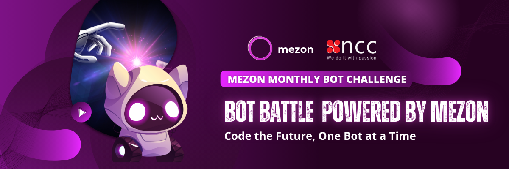

<div align="center">
  <h1>Mezon</h1>
  
  <p align="center">
    <strong>The Live, Work, and Play Platform – the best Discord alternative.</strong>
  </p>

  <p align="center">
    <a href="https://github.com/mezonai/mezon/releases"></a>
    <a href="https://github.com/mezonai/mezon/blob/main/LICENSE"></a>
    <a href="https://github.com/mezonai/mezon/stargazers"></a>
    <a href="https://github.com/mezonai/mezon/issues"></a>
    <a href="https://github.com/mezonai/mezon/network/members"></a>
  </p>

  <p align="center">
    <a href="https://mezon.ai"></a>
    <a href="https://mezon.ai/invite/1840696977034055680"></a>
    <a href="#contributing"></a>
  </p>
</div>

---

## About Mezon

Mezon is great for playing games and chilling with friends, or even building a worldwide community. Customize your own space to talk, play, and hang out., Mezon delivers enterprise-grade performance with sub-millisecond response times and support for millions of concurrent connections.

<div align="center">
  
</div>

### ✨ Key Features

-   **🔒 Security First** - End-to-end encryption, XSS protection, zero-knowledge architecture
-   **⚡ High Performance** - Sub-millisecond response times, millions of concurrent connections
-   **🌐 Cross-Platform** - Web, Desktop (Windows/macOS/Linux), Mobile (iOS/Android)
-   **🤖 AI-Powered** - Built-in content moderation, real-time translation, meeting summaries
-   **🔧 Extensible** - Custom bots, 100+ integrations, API-first design
-   **💰 Creator Economy** - Built-in monetization, premium memberships, token rewards

### 🎯 Use Cases

| Use Case               | Features                                             |
| ---------------------- | ---------------------------------------------------- |
| **Gaming Communities** | Voice chat, tournaments, streaming integration       |
| **Professional Teams** | Channels, file sharing, integrations, meeting tools  |
| **Content Creators**   | Monetization tools, community building, analytics    |
| **Personal Groups**    | Private spaces, family connections, secure messaging |

---

## 🚀 Quick Start

### For Users

1. **Web App**: Visit [mezon.ai](https://mezon.ai) - no installation required
2. **Desktop**: Download from [releases](https://github.com/mezonai/mezon/releases) for Windows, macOS, or Linux
3. **Mobile**: Get the app from [App Store](https://mezon.ai) or [Google Play](https://mezon.ai)

### For Developers

```bash
# Clone the repository
git clone https://github.com/mezonai/mezon.git
cd mezon

# Install dependencies
yarn install

# Start development server
yarn dev:chat
```

The application will be available at http://localhost:4200/

> 📖 **Need help?** Check out our [Developer Guide](docs/developer/SETUP.md) for detailed setup instructions.

---

## 🌟 Core Features

### 💬 Communication

-   **Rich Text Messaging** - Markdown support, threads, reactions, file sharing up to 500MB
-   **Voice & Video** - Crystal-clear HD calls supporting up to 1000 users
-   **Screen Sharing** - Built-in recording and streaming capabilities

### 🛡️ Security & Privacy

-   **End-to-End Encryption** - All messages, voice, and video communications
-   **Zero-Knowledge Architecture** - Client-side encryption, secure binary sockets
-   **XSS Protection** - Safe message rendering and content validation

### 🎯 Organization & Management

-   **Advanced Permissions** - Custom roles with granular permission controls
-   **Smart Notifications** - AI-powered filtering and priority management
-   **Event Scheduling** - Built-in calendar with RSVP system

### 🤖 AI-Powered Features

-   **Content Moderation** - Automated safety and community management
-   **Real-time Translation** - Support for 100+ languages
-   **Meeting Intelligence** - Auto-generated summaries and transcription

### 🔧 Integration & Extensibility

-   **API-First Design** - Comprehensive REST and WebSocket APIs
-   **Bot Framework** - Extensible platform with SDK support
-   **Third-party Integrations** - 100+ tools and custom webhooks

---

## 📦 Installation

### System Requirements

| Platform        | Requirements                                                   |
| --------------- | -------------------------------------------------------------- |
| **Web**         | Modern browser (Chrome 90+, Firefox 88+, Safari 14+, Edge 90+) |
| **Desktop**     | Windows 10+, macOS 10.15+, Ubuntu 18.04+                       |
| **Mobile**      | iOS 13.0+, Android 8.0+ (API level 26+)                        |
| **Development** | Node.js 18+, Yarn 1.22.4+, 4GB RAM minimum                     |

### Download Options

| Platform    | Download Link                   | Status    |
| ----------- | ------------------------------- | --------- |
| **Windows** | [Download](https://mezon.ai)    | ✅ Stable |
| **macOS**   | [Download](https://mezon.ai)    | ✅ Stable |
| **Linux**   | [Download](https://mezon.ai)    | ✅ Stable |
| **iOS**     | [App Store](https://mezon.ai)   | ✅ Stable |
| **Android** | [Google Play](https://mezon.ai) | ✅ Stable |
| **Web**     | [mezon.ai](https://mezon.ai)    | ✅ Stable |

---

## 👨‍💻 Development

### 🛠️ Development Setup

```bash
# Clone the repository
git clone https://github.com/mezonai/mezon.git
cd mezon

# Install dependencies
yarn install

# Available development commands
yarn dev:chat          # Start chat app (port 4200)
yarn dev:admin         # Start admin dashboard (port 4200)
yarn dev:mobile        # Start mobile development
yarn dev:desktop       # Start desktop app

# Build for production
yarn build:chat        # Build web chat app
yarn build:desktop     # Build desktop app
yarn build:mobile      # Build mobile apps

# Code quality
yarn lint              # Run linting
yarn format           # Format code
```

### 📁 Project Structure

```
mezon/
├── apps/              # Applications
│   ├── chat/          # Main web chat application
│   ├── admin/         # Admin dashboard
│   ├── desktop/       # Electron desktop app
│   ├── mobile/        # React Native mobile app
│   └── discover/      # Community discovery app
├── libs/              # Shared libraries
│   ├── components/    # Reusable UI components
│   ├── store/         # State management (Redux)
│   ├── transport/     # API & WebSocket clients
│   ├── core/          # Business logic
│   └── ui/            # Design system
└── docs/              # Documentation
```

### 🔧 Technology Stack

#### Frontend

-   **Framework**: React 18 with TypeScript
-   **State Management**: Redux Toolkit + RTK Query
-   **Styling**: Tailwind CSS
-   **Build Tool**: Nx Monorepo with Webpack
-   **Mobile**: React Native
-   **Desktop**: Electron

#### Backend & Infrastructure

-   **Core**: We built a custom server using Redis, ScyllaDB, and sockets to enable real-time communication.
-   **Mezon Mainnet**: [mmn](https://github.com/mezonai/mmn) - High-performance and zero free blockchain layer 1
-   **Real-time**: WebSocket with binary protocol
-   **Security**: E2E encryption, TLS 1.3
-   **Performance**: Sub-millisecond latency, horizontal scaling

#### Development Tools

-   **Testing**: Jest + Cypress
-   **Linting**: ESLint + Prettier
-   **CI/CD**: GitHub Actions
-   **Package Manager**: Yarn

### 📚 Getting Started

1. **Setup**: Follow the [Developer Guide](docs/developer/SETUP.md) for detailed setup instructions
2. **Architecture**: Review [Architecture docs](docs/developer/ARCHITECTURE.md) to understand the system
3. **Contribute**: Browse [open issues](https://github.com/mezonai/mezon/issues) for contribution opportunities
4. **Community**: Join our [developer community](https://mezon.ai/invite/1840696977034055680) for support and discussions

### 🔌 Extensibility

**Bot Development**

-   Build powerful bots using our official SDKs
-   Automate workflows and community management
-   Access comprehensive APIs for custom integrations

**Custom Themes**

-   Create custom themes and UI modifications
-   Brand customization for communities
-   Personalized user interfaces

**API Integration**

-   REST API and WebSocket support
-   Custom webhooks and third-party integrations
-   Extensive documentation and examples

> 🔗 **Resources**: [Bot Example](https://github.com/mezonai/mezon-bot-example) | [SDK Documentation](https://mezon.ai/docs/mezon-sdk-docs/)

## 🤝 Contributing

We welcome contributions from the community! Here's how you can help:

### Ways to Contribute

-   🐛 **Report Bugs**: Use our [issue tracker](https://github.com/mezonai/mezon/issues)
-   💡 **Feature Requests**: Suggest new features and improvements
-   💻 **Code Contributions**: Submit pull requests for bug fixes and features
-   📚 **Documentation**: Help improve our docs and guides
-   🌍 **Translation**: Help translate Mezon to more languages

### Development Process

1. Fork the repository
2. Create a feature branch (`git checkout -b feature/amazing-feature`)
3. Make your changes and add tests
4. Ensure all tests pass (`yarn test`)
5. Submit a pull request

> 📋 **Guidelines**: Please read our [Contributing Guide](CONTRIBUTING.md) for detailed information about our development process, coding standards, and pull request guidelines.

---

## 📚 Resources & Documentation

### 🚀 For Users

-   [**Web App**](https://mezon.ai/chat/direct/friends) - Try Mezon instantly
-   [**Community Directory**](https://mezon.ai/clans/) - Discover communities
-   [**User Guide**](docs/user-guides/GETTING_STARTED.md) - Getting started guide

### 🛠️ For Developers

-   [**Developer Guide**](docs/developer/SETUP.md) - Complete setup and development guide
-   [**API Documentation**](https://mezon.ai/docs/mezon-sdk-docs/) - REST API and WebSocket reference
-   [**Architecture Guide**](docs/developer/ARCHITECTURE.md) - System design and architecture
-   [**Bot Development**](https://github.com/mezonai/mezon-bot-example) - Bot creation tutorial

### 📦 SDKs & Libraries

-   [**JavaScript SDK**](https://github.com/mezonai/mezon-js) - Official JS/TS SDK
-   [**Go SDK**](https://github.com/mezonai/mezon-go-sdk) - Official Go SDK
-   [**Java SDK**](https://github.com/mezonai/mezon-java-sdk) - Official Java SDK
-   [**Mezon WebJs SDK**](https://github.com/mezonai/mezon-web-js) - SDK for channel apps integration
-   [**MCP Integration**](https://github.com/mezonai/mezon-mcp) - AI-ready integration

### 🌐 Community & Support

-   [**Community Hub**](https://mezon.ai/invite/1840696977034055680) - Join our official community
-   [**GitHub Discussions**](https://github.com/mezonai/mezon/discussions) - Ask questions and share ideas
-   [**Issue Tracker**](https://github.com/mezonai/mezon/issues) - Report bugs and request features
-   [**Developer Portal**](https://mezon.ai/developers/applications) - Build applications on Mezon

---

## 🔧 Troubleshooting

### Common Issues

**Installation Problems**

-   Ensure Node.js 18+ and Yarn 1.22.4+ are installed
-   Clear node_modules and reinstall: `rm -rf node_modules && yarn install`
-   Check [system requirements](#-installation) for your platform

**Development Issues**

-   Port conflicts: Change port in project configuration
-   Build failures: Run `yarn lint` and `yarn format` to fix code issues
-   WebSocket connection issues: Check firewall and proxy settings

**Performance Issues**

-   Enable hardware acceleration in browser settings
-   Close unnecessary applications to free up system resources
-   Update to the latest version for performance improvements

> 🆘 **Need Help?** Visit our [troubleshooting guide](docs/TROUBLESHOOTING.md) or ask in our [community chat](https://mezon.ai/invite/1840696977034055680).

---

## 📄 License & Legal

-   **License**: [MIT License](LICENSE) - Free for personal and commercial use
-   **Privacy Policy**: [mezon.ai/privacy](https://mezon.ai/privacy)
-   **Terms of Service**: [mezon.ai/terms](https://mezon.ai/terms)
-   **Security Policy**: [SECURITY.md](SECURITY.md)

---

## 🙏 Acknowledgments

Mezon is built on top of amazing open-source technologies:

-   [webrtc](https://github.com/pion/webrtc) - Pion WebRTC A pure Go implementation of the WebRTC API
-   [React](https://reactjs.org/) - UI framework
-   [Nx](https://nx.dev/) - Monorepo tooling
-   And many other fantastic open-source projects

<div align="center">
  <p>
    <strong>Made with ❤️ by the Mezon Team</strong><br>
    <em>Connecting communities worldwide</em>
  </p>
  
  <p>
    <a href="https://github.com/mezonai/mezon">⭐ Star us on GitHub</a> •
    <a href="https://mezon.ai/invite/1840696977034055680">💬 Join our community</a> •
    <a href="https://github.com/mezonai/mezon/issues/new/choose">🐛 Report an issue</a>
  </p>
</div>
