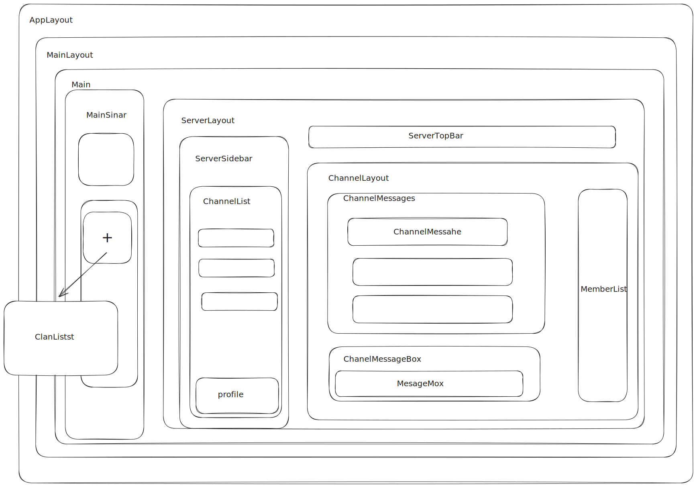

# MezonFe

✨ **This workspace has been generated by [Nx, a Smart, fast and extensible build system.](https://nx.dev)** ✨

## Installing Nx Globally

`npm install --global nx@latest`

## Notes

-   using `Git Bash` to run the commands
-   using `VSCode` as the code editor

## Sync dependencies

-   Run `npm run sync` to sync dependencies

## Start the app

To start the development server run `nx run dev:chat`. Open your browser and navigate to http://localhost:4200/. Happy coding!

## Linting

-   Run `npm run lint` to lint the codebase
-   Run `npm run lint:fix` to fix the linting issues

## Format

-   Run `npm run format` to format the codebase
-   Run `npm run format:fix` to fix the formatting issues

## Architecture Overview

## Workspace Structure

We are using monorepo architecture to manage the codebase. The workspace is divided into multiple applications and libraries. Each application is a standalone application and each library is a reusable codebase.

Workspace will be managed by [`Nx`](https://nx.dev/) which is a smart, fast and extensible build system.

### Applications

All applications are located in the `apps` directory. Each application is a standalone React application and has its own codebase.

-   `chat`: Chat application
-   `admin`: Admin application

Currently, we only focus on the `chat` application.

### Libraries

All libraries are located in the `libs` directory. Each library is a reusable codebase and can be used by multiple applications.

-   `ui`: UI elements library, the components are `stateless` and `dumb`
-   `components`: Shared components library, the components are `stateful` and `smart` perform some logic through `context` and `hooks`
-   `core`: Core library, contains the core logic of the application, could be reused by multiple applications e.g. web, mobile, desktop
-   `transports`: Transport layer library, contains the logic to communicate with the server through `mezon-js` library
-   `store`: State management library, contains the logic to manage the state of the application using `redux` and `redux-toolkit`
-   `assets`: Assets library, contains the assets used by the applications and libraries
-   `logger`: Logger library, contains the logic to log the messages
-   `utils`: Utility functions library

## Data Flow

We are using `one-way` data flow architecture to manage the data flow of the application. The data flow is unidirectional follow the `Redux` pattern.

See more about the `Redux` pattern [here](https://redux.js.org/tutorials/fundamentals/part-2-concepts-data-flow).

The core concepts are `one-way` data flow and `single source of truth`.

## Application data flow

The application data flow is managed by some packages:

-   `mezon-js`: The core package to communicate with the server through `WebSocket` and `REST` API
    -   `WebSocket`: send and listen to the messages from the server
    -   `REST`: send and receive the messages from the server
-   `store`: The state management package to manage the state of the application. store is divided into multiple slices, each slice is a standalone slice and has its own reducer, action, and selector.

    -   `slice`: A standalone slice of the store, contains the reducer, action, and selector
    -   `reducer`: A function to manage the state of the application
    -   `action`: A function to dispatch the action to the reducer
    -   `selector`: A function to select the state from the store

-   `routing`: The routing package to manage the routing of the application. The routing is managed by `react-router-dom` package.
    -   loader: The loader to load the component dynamically
    -   route: The route to navigate to the component
    -   page: The page to render the component

### Data concept

-   When the application starts, based on the initial route, the application will load the components and pages
-   Before render components and pages, the application will trigger `loader` to load the initial data
-   The `loader` will trigger the `action` to fetch the data from the server
-   The component will render the data based on the state of the store
-   The dispatched action will trigger an `asyncThunk` to fetch the data from the server using `mezon-js` package
-   The `asyncThunk` returns the data from the server and updates the state of the store by an `extraReducers` function
-   The component or hook will select the data from the store using `useSelector`
-   the selectors will select the data from the store based on the state of the store
-   When user interacts with the component, the component will dispatch the action to update the state of the store
-   We could group the data and logic into a custom hook to manage the data and logic of the component
-   The component could use the custom hook to manage the data and logic of the component

## Layouting

how to layout the components and pages

We have sevaral layout components to handle layout based on the route:

-   `/` - `AppLayout`: The layout for the application
-   `/chat` -[logged in]- `MainLayout`: The layout for the main page
-   `Main`: The main page to render the global components
-   `/chat/server/:id` - `ClanLayout`: The layout for the server page
-   `/chat/server/:id/channel/:id` - `ChannelLayout`: The layout for the channel page
-   routes are defined in the [./apps/chat/src/app/routes/index.tsx](./apps/chat/src/app/routes/index.tsx) file
-   We are using `react-router` v6 to manage the routing of the application, see more about the `react-router` v6 [here](https://reactrouter.com/en/6.22.1/start/overview)

### Access Control

Access control is managed by the `policies` slice. each user has it own permissions to access the resources. The permission is managed by the `policies` slice.

There are several ways to manage the access control:

-   using `policies` slice and `selectAllPermissionsUser` to get the permissions of the user
-   using `useSelector(selectAllPermissionsUser)` to get the permissions of the user
-   using `useUserPermissions` to get the permissions of the user
-   using `UserRestrictionZone` to control displaying the components based on the user permissions
-   using `useUserRestriction` to get the user restrictions based on the user permissions

## Performance Optimization

### Performance Factors

The application performance is mostly affected by these factors:

-   The routing structure: we keep the routing straitforward and simple, make sure that one route is only re-render when the route changes
-   Unnecessary re-render: we use `memo` and `useMemo` to prevent unnecessary re-render
-   Memory leak: we use `useEffect` and `clear function` to prevent memory leak
-   Function changes reference: we use `useCallback` to prevent function changes reference
-   Api calls: we use `store` and `memoizee` to cache the api calls
-   Wrong level of abstraction: we use `custom hook` to manage the data and logic of the component, make sure that the custom hook group data of same level of abstraction, and not re-render the component when the unrelated data changes

### Performance Tools

We use several tools to measure the performance of the application:

-   `React DevTools`: to measure the performance of the application
-   `Chrome DevTools`: to measure the performance of the application

## Conventions and Guidelines

## Code Formatting

Using `Prettier` and `ESLint` to format the codebase. The codebase should be formatted before committing the code.

## Naming Convention

-   `PascalCase` for the components and pages
-   `camelCase` for the functions and variables

See more about the naming convention [here](https://github.com/airbnb/javascript/tree/master/react#naming)
