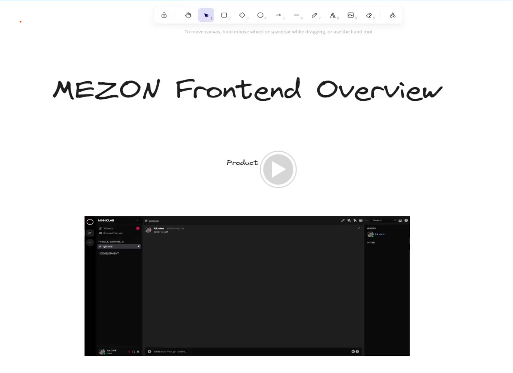
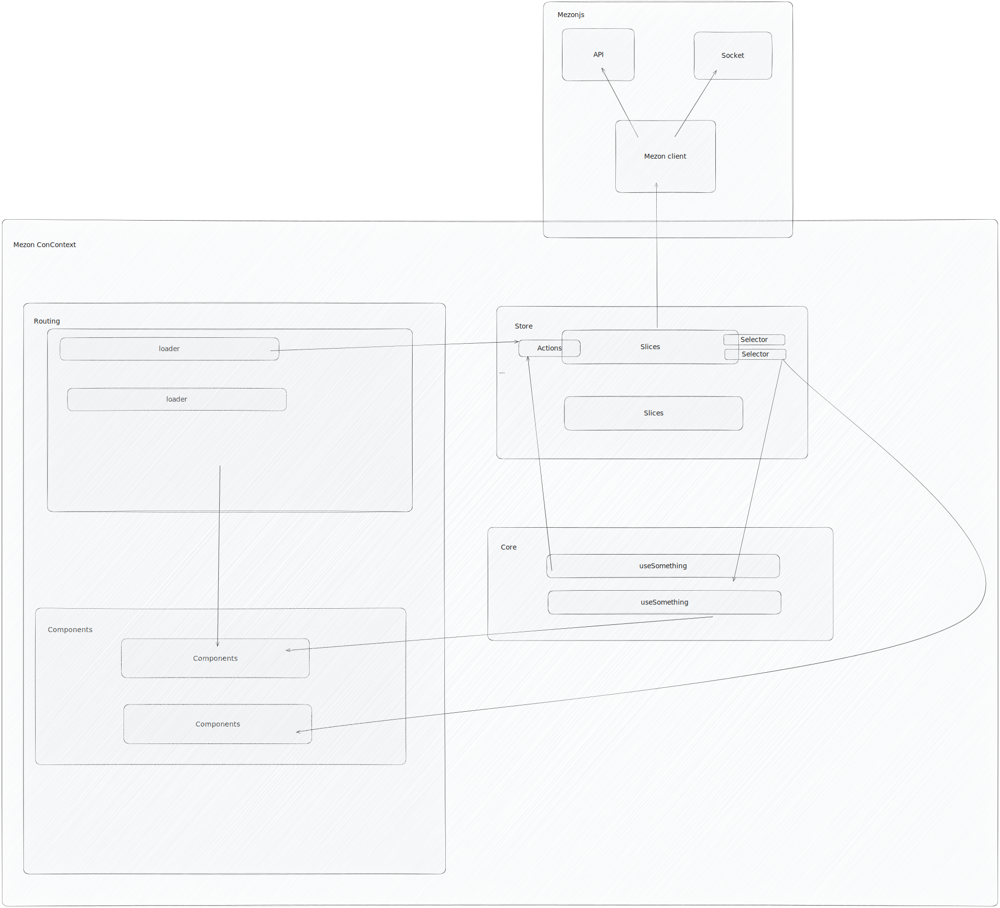
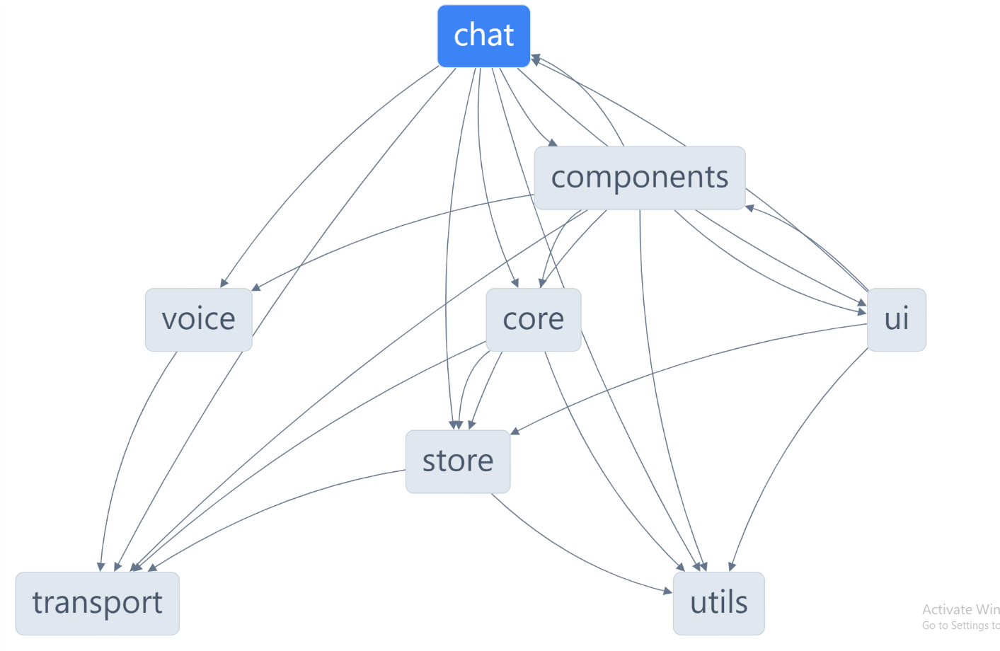

# Mezon Architecture

This document provides a detailed overview of Mezon's technical architecture and design decisions.

## High-Level Architecture

[](https://drive.google.com/file/d/1SssyfwQGJFLR80ONQ4KvV3W8qi27yt_G/preview)

## System Components

### Frontend Applications

#### Chat Application (`apps/chat`)
- **Framework**: React 18+ with TypeScript
- **State Management**: Redux Toolkit with RTK Query
- **Routing**: React Router v6
- **Styling**: Tailwind CSS with custom design system
- **Build Tool**: Nx with Webpack

#### Admin Application (`apps/admin`)
- **Purpose**: Administrative dashboard for server management
- **Features**: User management, analytics, system monitoring
- **Security**: Role-based access control with JWT authentication

#### Desktop Application (`apps/desktop`)
- **Framework**: Electron
- **Features**: Native system integration, auto-updates, offline support
- **Platform**: Cross-platform (Windows, macOS, Linux)

### Core Libraries

#### UI Layer (`libs/ui`)
- **Philosophy**: Atomic design with stateless components
- **Components**: Base UI elements (buttons, inputs, modals)
- **Styling**: Design tokens and theme system
- **Accessibility**: WCAG 2.1 AA compliance

#### Components Layer (`libs/components`)
- **Purpose**: Stateful business logic components
- **Architecture**: Container/Presenter pattern
- **Context**: React Context for local state management
- **Hooks**: Custom hooks for component logic

#### Core Layer (`libs/core`)
- **Domain Logic**: Business rules and entities
- **Utilities**: Cross-platform utility functions
- **Constants**: Application-wide constants and enums
- **Types**: Shared TypeScript interfaces and types

#### Transport Layer (`libs/transports`)
- **API Client**: REST API communication
- **WebSocket**: Real-time communication
- **Authentication**: Token management and refresh
- **Caching**: Request/response caching strategies

#### Store Layer (`libs/store`)
- **State Management**: Redux Toolkit slices
- **Async Operations**: RTK Query for data fetching
- **Selectors**: Memoized state selectors
- **Middleware**: Custom middleware for logging and analytics

## Data Flow Architecture



### One-Way Data Flow

```
User Action → Action Creator → Reducer → Store → Component → UI
```

### State Management Pattern

1. **Actions**: Dispatched from components
2. **Async Thunks**: Handle side effects and API calls
3. **Reducers**: Update state immutably
4. **Selectors**: Derive computed state
5. **Components**: Subscribe to state changes

### Real-Time Communication

```
WebSocket Events → Socket Middleware → Action Dispatch → State Update → UI Refresh
```

## Dependency Management

### Allowed Dependencies

```
apps/chat      → libs/*
apps/admin     → libs/*
apps/desktop   → libs/*

libs/components → libs/ui
libs/components → libs/store
libs/components → libs/core

libs/store     → libs/transports
libs/store     → libs/utils
libs/store     → libs/core

libs/transports → libs/core
libs/transports → libs/utils
```

### Dependency Graph



### Anti-Patterns (Forbidden)

```
❌ apps/chat → apps/admin
❌ libs/ui → libs/components
❌ libs/transports → libs/store
❌ Cross-platform lib dependencies
```

## Communication Architecture

### API Communication

#### REST API (`libs/transports/api`)
- **Base URL**: Configurable endpoint
- **Authentication**: JWT Bearer tokens
- **Error Handling**: Centralized error processing
- **Caching**: TTL-based response caching
- **Rate Limiting**: Client-side request throttling

#### WebSocket Communication (`libs/transports/socket`)
- **Protocol**: WebSocket with Protocol Buffer serialization
- **Reconnection**: Automatic reconnection with exponential backoff
- **Message Queue**: Offline message queuing
- **Heartbeat**: Connection health monitoring

### Message Flow

```
Component → Action → Thunk → API/Socket → Response → Reducer → State → Component
```

## Security Architecture

### Authentication Flow

1. **Login Request**: Credentials sent to auth endpoint
2. **Token Generation**: JWT with refresh token
3. **Token Storage**: Secure storage (httpOnly cookies for web)
4. **Token Refresh**: Automatic refresh before expiration
5. **Session Management**: Cross-tab session sync

### Data Protection

- **Encryption**: TLS 1.3 for transport
- **Message Encryption**: End-to-end for private messages
- **Input Validation**: Client and server-side validation
- **XSS Protection**: Content Security Policy headers
- **CSRF Protection**: Double-submit cookie pattern

## Performance Architecture

### Optimization Strategies

#### Bundle Optimization
- **Code Splitting**: Route-based lazy loading
- **Tree Shaking**: Dead code elimination
- **Module Federation**: Micro-frontend architecture ready
- **Asset Optimization**: Image compression and WebP support

#### Runtime Performance
- **Memoization**: React.memo and useMemo
- **Virtualization**: Large list rendering optimization
- **Debouncing**: Input and API call optimization
- **Caching**: Multi-layer caching strategy

#### Memory Management
- **Cleanup**: useEffect cleanup functions
- **Weak References**: Prevent memory leaks
- **Garbage Collection**: Optimal object lifecycle management

### Monitoring and Analytics

- **Performance Metrics**: Web Vitals tracking
- **Error Monitoring**: Centralized error logging
- **User Analytics**: Privacy-compliant usage tracking
- **Performance Profiling**: React DevTools integration

## Build and Deployment

### Build System

#### Nx Workspace
- **Monorepo Management**: Shared tooling and configuration
- **Dependency Graph**: Intelligent build ordering
- **Caching**: Distributed computation caching
- **Task Orchestration**: Parallel task execution

#### Build Pipeline
```
Source Code → Type Check → Lint → Test → Build → Bundle → Deploy
```

### Deployment Architecture

#### Environment Strategy
- **Development**: Local development with hot reload
- **Staging**: Pre-production testing environment
- **Production**: Multi-region deployment

#### CI/CD Pipeline
- **Source Control**: Git with feature branch workflow
- **Testing**: Automated unit and integration tests
- **Building**: Containerized builds with Docker
- **Deployment**: Blue-green deployment strategy

## Scalability Considerations

### Horizontal Scaling
- **Component Architecture**: Modular and reusable
- **State Management**: Normalized state structure
- **API Design**: RESTful with GraphQL readiness
- **Caching Strategy**: CDN and browser caching

### Development Scalability
- **Team Structure**: Feature-based team organization
- **Code Organization**: Domain-driven directory structure
- **Testing Strategy**: Comprehensive test coverage
- **Documentation**: Living documentation practices

## Future Architecture Considerations

### Planned Enhancements
- **Micro-frontends**: Module federation implementation
- **GraphQL**: Migration from REST API
- **Service Workers**: Offline-first capabilities
- **WebRTC**: Direct peer-to-peer communication
- **WebAssembly**: Performance-critical operations

### Technology Roadmap
- **React 19**: Concurrent features adoption
- **Next.js Migration**: SSR and SSG capabilities
- **Edge Computing**: Edge function deployment
- **AI Integration**: Machine learning model integration

---

## Development Guidelines

### Code Organization
```
src/
├── components/          # Reusable UI components
├── pages/              # Route components
├── hooks/              # Custom React hooks
├── store/              # Redux slices and selectors
├── services/           # API and business logic
├── utils/              # Utility functions
├── types/              # TypeScript type definitions
└── constants/          # Application constants
```

### Naming Conventions
- **Components**: PascalCase (e.g., `MessageList`)
- **Files**: kebab-case (e.g., `message-list.component.tsx`)
- **Functions**: camelCase (e.g., `handleMessageSend`)
- **Constants**: SCREAMING_SNAKE_CASE (e.g., `API_BASE_URL`)

### Best Practices
- Single Responsibility Principle for components
- Immutable state updates
- Comprehensive error boundaries
- Accessibility-first development
- Performance-conscious coding

---

For implementation details and development setup, see the [Developer Guide](../../DEVELOPER_GUIDE.md).